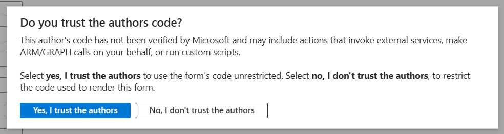
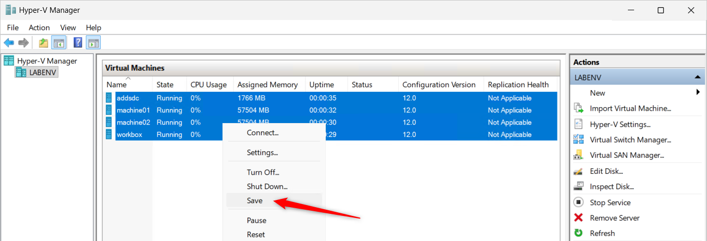

# Lab tour

## Virtual machines

The lab environment consists of three roles of Hyper-V VMs on a single Azure VM.

| Computer/VM name | Description | VM kind | AD domain joined | Operating system | Notes |
| ---- | ---- | ---- | ---- | ---- | --- |
| labenv-vm1 (default) | This Azure VM hosting the lab environment. | Azure VM | No | Windows Server 2025 Datacenter Azure Edition Hotpatch | |
| machine## | Member machines of the cluster. | Hyper-V VM on Azure VM | Depends on your deployment option | Depends on your deployment option. You can choose Azure Stack HCI OS or Windows Server with Desktop Experience. | `##` in the name is changed depending on the number of machines such as `01`, `02`, `03`, ... |
| addsdc | A domain controller of Active Directory Domain Services for the lab environment. | Hyper-V VM on Azure VM | Yes | Windows Server 2025 Datacenter Evaluation Server Core | |
| workbox | A machine for your work in the lab environment. | Hyper-V VM on Azure VM | Yes | Windows Server 2025 Datacenter Evaluation with Desktop Experience | Windows Admin Center works on this server with gateway mode, and many server management tools are installed on this server. |

### Azure VM

- Deploy options
    - **Visual Studio Code:** You can install Visual Studio Code during the deployment if you choose the deployment option.

- Credentials

    | Account type | User name | Password |
    | ---- | ---- | ---- |
    | Local administrator | Your supplied user name at Azure VM deployment. | Your supplied password at Azure VM deployment. |

- Remote Desktop access
    - You need to allow Remote Desktop access to your lab host Azure VM from your local machine. It can be by [enabling JIT VM access](https://learn.microsoft.com/en-us/azure/defender-for-cloud/just-in-time-access-usage) or [adding an inbound security rule in the Network Security Group](https://learn.microsoft.com/en-us/azure/virtual-network/tutorial-filter-network-traffic#create-security-rules).
    - The recommended way is using JIT VM access.

- Desktop icons

    | Icon | Notes |
    | ---- | ---- |
    | Windows Admin Center | Open Windows Admin Center with Microsoft Edge. |
    | Management tools server | Connect to the **workbox** Hyper-V VM using Remote Desktop. |
    | machine01 | Connect to the **machine01** Hyper-V VM using Remote Desktop. |
    | Hyper-V Manager | Open the Hyper-V Manager to manage Hyper-V VMs in the lab environment. |
    | Visual Studio Code | There is this icon if installed via deployment option. |

- Data volume
    - Volume **V:** is the data volume. Hyper-V VM files, VHD files, ISO file and other working files are stored on this volume.

- If you deallocate your Azure VM, all Hyper-V VMs that run on your Azure VM are shutting down according to the Automatic Stop Action of the Hyper-V setting.
    - Sometimes, you will see the unexpected shutdown dialog at the next sign-in to the Hyper-V VMs. It means the Hyper-V VM could not complete shutting down in acceptable time. It's rare that unexpected shutdown has impacts on your lab environment.
    - You can manually shutdown the Hyper-V VMs before Azure VM deallocation safely.

- The log files of the custom scripts are stored under `C:\temp\hcilab-logs` in the lab host Azure VM. Those log files are helpful for troubleshooting when deployment fails.

### Hyper-V VMs on the Azure VM

- Deploy options
    - **Join to the AD DS domain:** Should you choose to **Not join** if you plan to [provisioning your HCI cluster from Azure portal](https://learn.microsoft.com/en-us/azure-stack/hci/deploy/deploy-via-portal).
    - **Create HCI cluster:** You can automatically create your HCI cluster during the deployment if you choose the deployment option. Also, by not choosing it, you can manually create an HCI cluster for cluster creation with custom configuration such as Network ATC.

- AD domain name (default): **lab.internal**

- Credentials

    | Account type | User name | Password |
    | ---- | ---- | ---- |
    | Domain administrator | LAB\Administrator | Your supplied password during the lab deployment. |
    | Local administrator | Administrator | Your supplied password during the lab deployment. |

- You can access each Hyper-V VMs such as **workbox**, **machine##**, **addsdc** in you lab environment via Remote Desktop connection (mstsc.exe) and Virtual Machine connection (vmconnect.exe) from the Azure VM that hosted the lab environment.

- Windows Server 2022/2025 Datacenter Evaluation expires in **180 days**.

- workbox

    - Windows Admin Center works on the **workbox** VM as gateway mode. You can access via `https://wac/` from the **workbox** VM and the lab host VM.
    - Traditional server management tools (RSAT) are installed on the **workbox** VM.

    - Desktop icons on the wac VM

        | Icon | Notes |
        | ---- | ---- |
        | Windows Admin Center | Open Windows Admin Center with Microsoft Edge.  |
        | machine01 | Connect to the **machine01** Hyper-V VM using Remote Desktop. |

## Networking

### Simplified logical networking configuration

- [Large image](https://raw.githubusercontent.com/tksh164/hci-lab/main/docs/media/hci-lab-networking-logical-simplified.svg)

### _With_ the HCI cluster creation option deployment

- [Large image](https://raw.githubusercontent.com/tksh164/hci-lab/main/docs/media/hci-lab-networking-with-hci-cluster.svg)

### _Without_ the HCI cluster creation option deployment

- [Large image](https://raw.githubusercontent.com/tksh164/hci-lab/main/docs/media/hci-lab-networking-without-hci-cluster.svg)

## Troubleshooting steps

You can do troubleshoot the following steps when your HCI Lab deployment failed.

1. Check the deployments of the target resource group in Azure portal then identify which step failed.
2. Connect to the labenv VM via RDP or Bastion.
3. Identify the last modified log file in `C:\Temp\hcilab-logs`. It's achieved by sorting the Date modified column.
    - If your deployment failed in the base VHD creation or VM creation, you should also check the labenv_create-base-vhd.log or labenv_create-vm.log because they are working in parallel and those files have summary information to get which parallel jobs were failed. The summary information is located at the end part of the files. 
3. Check the exception information in the identified log file. The exception information fenced `====` or `####`, and it's titled with `Handled Exception` or `UNHANDLED EXCEPTION`. The exception information has stack trace in the PowerShell script, it will help to identify the cause.

Also, you can check input values and output values of each deployment on the target resource group in Azure portal. They are helpful to troubleshoot if the input value was incorrect.

**HCI Lab deployment dependencies:**

## Frequently asked questions

### Why the trust confirmation message showing when open "Deploy to Azure"?

Because the custom deployment form for the HCI Lab template calls Azure Resource Manager API (ARM API) that "[Resource Skus - List](https://learn.microsoft.com/rest/api/compute/resource-skus/list)" to retrieve the maximum number of disks of your selected VM size ([Reference to the code](https://github.com/tksh164/hci-lab/blob/85b4debc4a755363af856a2a0ecab8bf4bca75d6/uiforms/uiform.json#L172-L183)). The reason of this design, the HCI Lab template deploys maximum number of disks to get best storage performance and low cost.

Recommend to choose **Yes, I trust the authors** to use the user friendly deployment UI.

### Which Azure VM size is recommend?

**Standard_E16s_v5** that is the default VM size is recommended for most lab use cases of tow nodes. The default VM size has the reasonable performance & cost balance, and available in many regions. Use bigger VM sizes if you want to use 3+ nodes.

### How long an HCI Lab deployment taking?

The deployment duration depends on your deployment options. Usually it takes 30 minutes to 90 minutes, or more.

### How to stop the HCI Lab's Azure VM?

You can **Save** the lab VMs from the **Hyper-V Manager** within your HCI Lab Azure VM before deallocate your HCI Lab Azure VM. Also you can start (resume) the saved lab VMs from the Hyper-V Manager when you resume your work in your lab.

